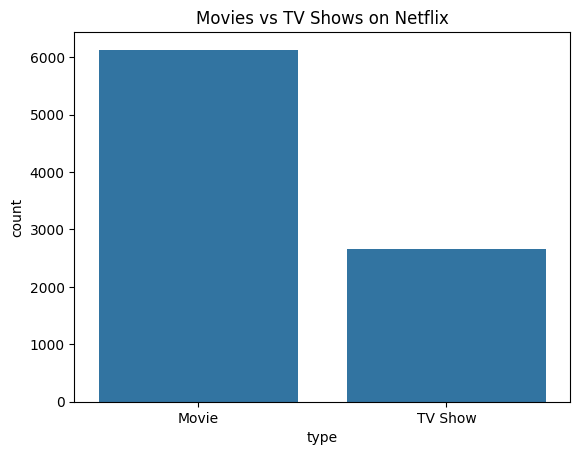
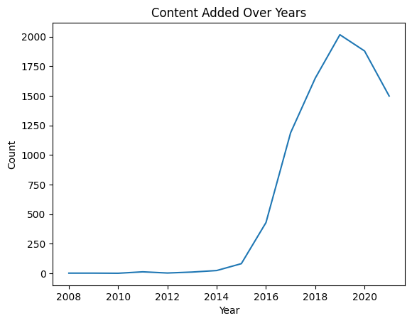
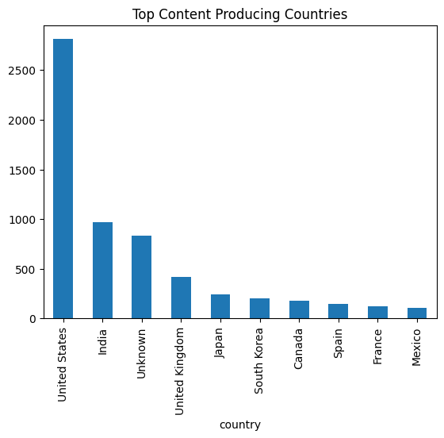
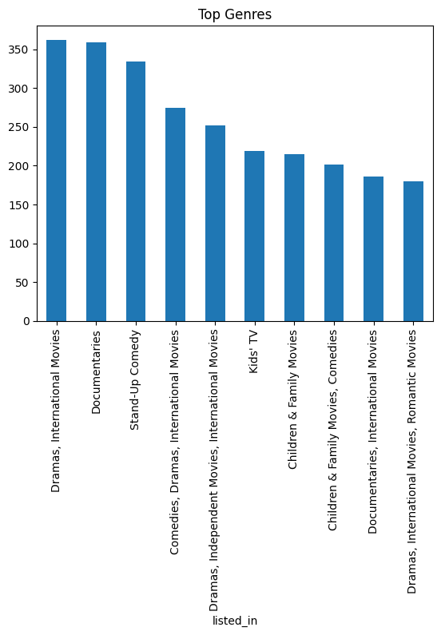

Exploratory Data Analysis on Netflix Dataset
1. Introduction

This project performs Exploratory Data Analysis (EDA) on a dataset of movies and TV shows available on Netflix. The objective is to uncover patterns, trends, and insights related to content distribution, growth over time, genres, and audience ratings. EDA helps in understanding the structure of data and extracting meaningful insights for decision-making.

2. Dataset Overview

The dataset contains information about Netflix content, including:

Type (Movie or TV Show)
Title
Director and Cast
Country of origin
Date added to Netflix
Release year
Rating
Duration
Genre (listed_in)

The dataset includes a mix of numerical and categorical features useful for analysis.

3. Data Cleaning

The following preprocessing steps were performed:

Removed missing values from important columns such as date_added
Filled missing values in director, cast, and country with "Unknown"
Removed duplicate records
Converted date_added column to datetime format
Extracted new features such as year_added and month_added for time-based analysis
4. Data Analysis & Visualizations
4.1 Movies vs TV Shows

A comparison of content types shows that movies are more prevalent than TV shows on Netflix.

4.2 Content Growth Over Time

Analysis of content added over the years reveals a significant increase after 2015, indicating rapid expansion of the platform.

4.3 Top Content Producing Countries

The United States contributes the highest number of titles, followed by other countries, highlighting its dominance in content production.

4.4 Genre Distribution

Drama, International Movies, and Comedies are among the most common genres available on Netflix.

4.5 Ratings Distribution

Most content is rated for mature audiences (e.g., TV-MA, TV-14), indicating a focus on adult viewers.

4.6 Duration Analysis

Most movies have durations ranging between 80 to 120 minutes, which is typical for feature films.

5. Key Insights
Netflix has a higher number of movies compared to TV shows
Content addition increased significantly after 2015
The United States is the leading contributor of content
Drama and international genres dominate the platform
Most content is targeted toward mature audiences
Movie durations are generally between 80–120 minutes
6. Conclusion

The analysis reveals that Netflix has experienced rapid growth in recent years, with a strong focus on movie content and international expansion. The platform caters largely to mature audiences and offers a wide variety of genres, making it a diverse entertainment platform. These insights can help understand user preferences and content strategy.

7. Tools Used
Python
Pandas
Matplotlib
Seaborn